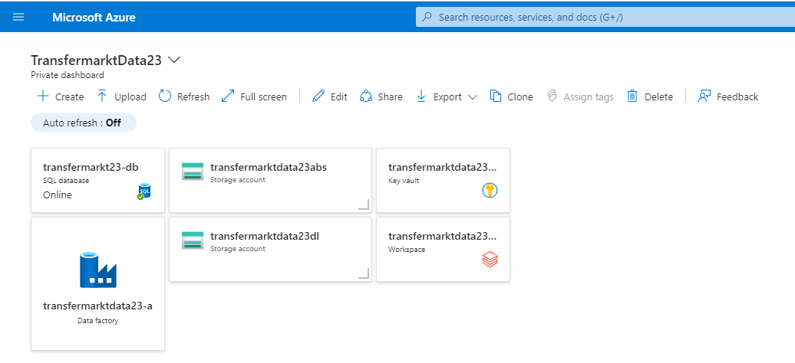

# Azure Soccer (Transfermarkt) Project w/ Azure Data Factory and Databricks (PySpark)!

### Technologies and Services Used
- Azure Data Factory
- Databricks
- Azure Data Lake (Gen2)
- Azure Blob Storage
- Python
- PySpark
- SQL
- Azure SQL Database
- PowerBI

## Purpose and Summary
The goal of this data engineering project was to move soccer transfermarkt (German data source) through an Azure Data Factory pipeline system, ultimately it landing in a Power BI dashboard.

## Data Source
Transfermarkt Data: https://www.kaggle.com/datasets/davidcariboo/player-scores

## Azure Setup
We will be using the following resources within Azure: Data Factory, Databricks, Azure Blob Storage (Storage Account), Azure Data Lake Gen2 (Storage Account), SQL Database, and a Key Vault.
A resource group was created to hold all of these resources.

DASHBOARD IMG

## Project Steps

### Ingestion into Azure Blob Storage
The first step was to upload the CSV files into a Blob Storage container called 'soccer-data-dump'.

IMG

### ADL2 Container Creation
Two containers were created inside of the Azure Data Lake Gen2: raw and clean. Raw will recieve the CSV files from the Blob Storage, and the clean container will contain the Databricks transformed files.

IMG

### Azure Data Factory Datasets and Pipelines
Datasets were formed with ADF that were used to copy the CSV files from the Blob Storage to the Data Lake.

IMG

ADF pipelines were then used to check the Blob Storage files, and then the CSVs were copied into the Data Lake's raw container.

IMG pipes

IMG raw

### Databricks Transformation
Databricks and PySpark were used to read in and transform the CSV files. After they were altered, they were then uploaded into the Data Lake's clean container.

IMG

This Databricks notebook is orchestrated by Azure Data Factory.

IMG

### Azure Data Studio Playground
I created tables within Azure Data Studio and used the soccer transfermarkt data to play around with different SQL queries, in order to explore the data.

IMG

### PowerBI Integration
The clean data was then uploaded into a Power BI PBIX file. **The dashboard is simply a rough visualization of some data points. It is not an accurate attempt at designing an excellent dashboard**

IMG

